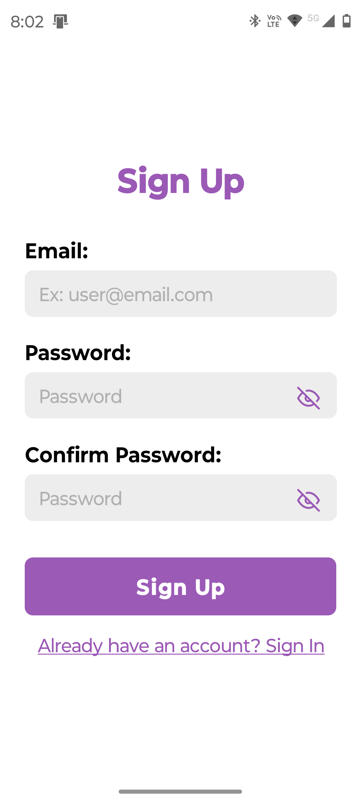
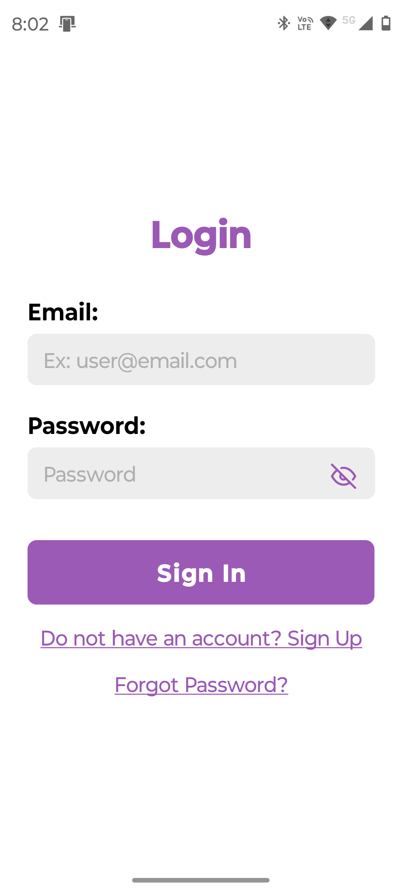
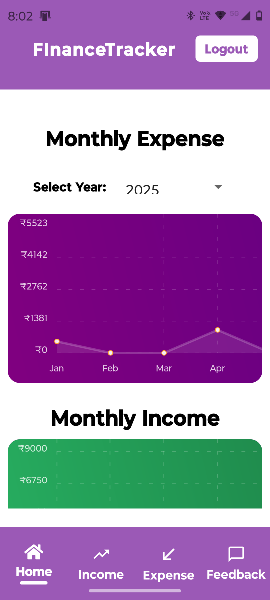
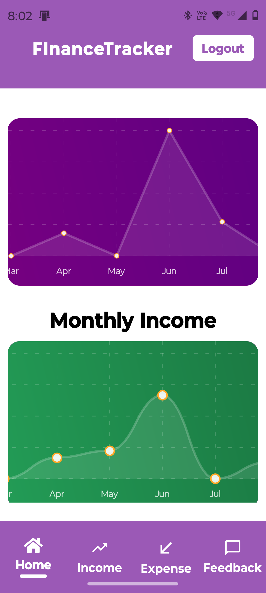
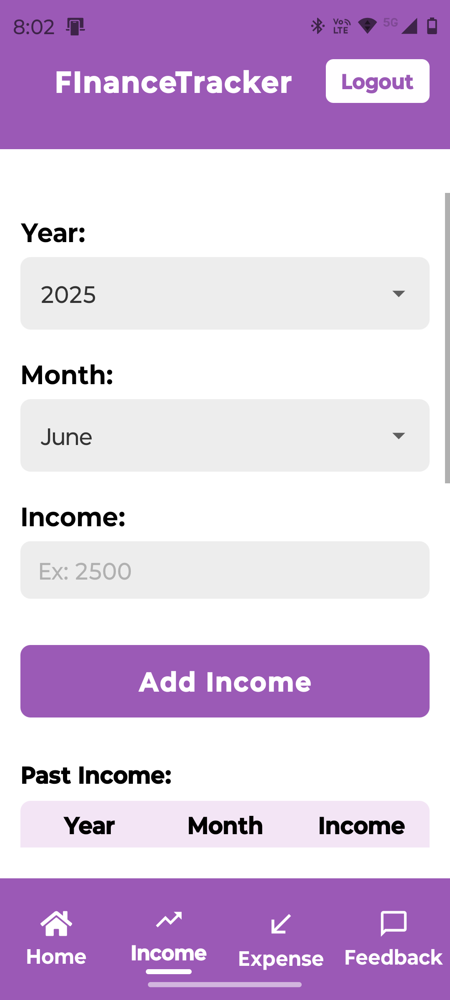
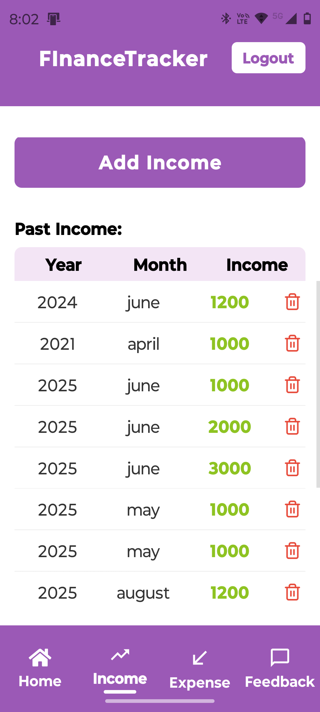
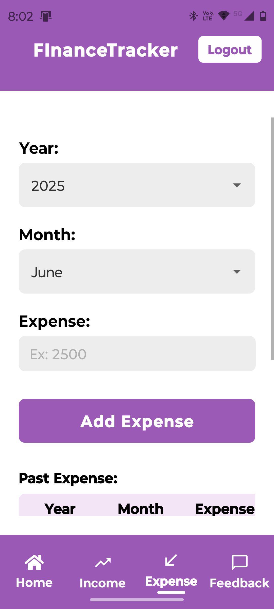
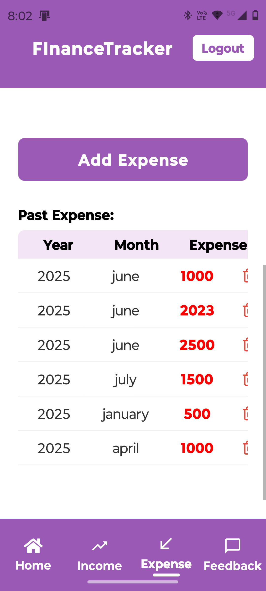
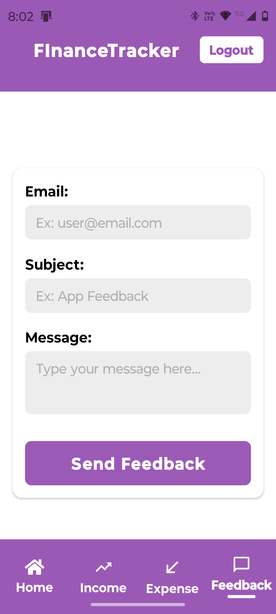

# 💸 FinanceTracker — Your Pocket-Sized Financial Dashboard 📊

[](https://docs.expo.dev/)
[](https://supabase.com/)

Welcome to **FinanceTracker**, a beautifully minimal yet powerful personal finance visualizer. Track your **monthly expenses and income** with sleek, interactive charts — powered by React Native, Expo, and Supabase.

---

## ✨ Features

🎯 **Monthly Charts**  
📅 Select any year to see monthly breakdowns of your income and expense trends.

📈 **Interactive Line Charts**  
Smooth, scrollable, and responsive charts using `react-native-chart-kit`.

🔐 **User-Specific Data Fetching**  
Secure data fetching from Supabase based on the logged-in user's ID.

🚀 **Mobile Optimized UI**  
Responsive, touch-friendly design with auto-adaptive layouts and SafeArea integration.

🎨 **Clean Visual Design**  
Vibrant gradients for charts, easy-to-read labels, and modern styling — all without CSS animations.

---

## 📹 Sneak Peek

<p align="center">
  
  
  
  
  
  
  
  
  
</p>

---

## 🔧 Tech Stack

- **React Native + Expo**: For blazing-fast mobile dev experience
- **Supabase**: Auth and database backend
- **react-native-chart-kit**: Gorgeous line charts
- **@react-native-picker/picker**: Year selector for data filtering

---

## 🧪 Code Highlights

**Live chart updates**  
📉 Data is dynamically grouped by month and visualized with automatic zero-filling for months with no entries.

```tsx
const expenseValues = monthOrder.map((m) => expenseByMonth[m] || 0);
```

**Year filter for analytics**

```tsx
<Picker
  selectedValue={selectedYear}
  onValueChange={(itemValue) => setSelectedYear(itemValue)}
>
  {availableYears.map((year) => (
    <Picker.Item key={year} label={`${year}`} value={year} />
  ))}
</Picker>
```

---

## 🚀 Getting Started

Follow these steps to get the project running locally on your machine.

### 1. 📦 Clone the repository

```bash
git clone https://github.com/omegaopinmthechat/FInanceTracker.git
cd FInanceTracker
```

### 2. 📱 Install dependencies

```bash
npm install
# or
yarn
```

### 3. 🔌 Set up Supabase

Create a `.env` file or use an existing config inside `@/utils/supabase.js` and add your Supabase project URL and anon key:

```js
export const supabase = createClient(
  "https://your-project.supabase.co",
  "your-anon-key"
);
```

Make sure your Supabase tables:
- `Income` and `Expense`
  - Have fields: `user_id`, `month`, `year`, `income`, `expense`

### 4. 🧪 Run the app

```bash
npx expo start
```

Scan the QR code with your phone using Expo Go, or run on Android/iOS simulator.

---

## 🧠 Future Improvements

- 📅 Add date-range filtering
- 📝 AI budget planner
- 🌑 Dark mode toggle


---


> 💬 “Visualize your money, control your story.”
